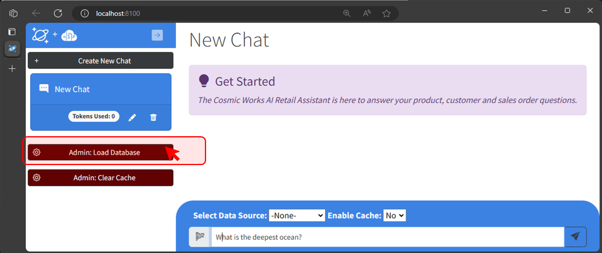
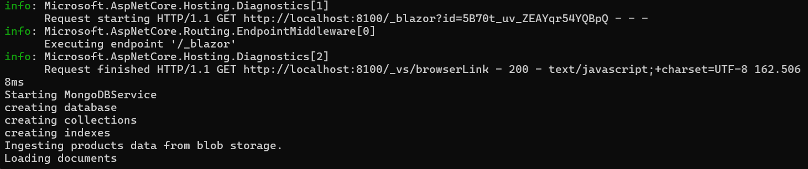

# Build a Copilot app using Azure Cosmos DB for MongoDB, Azure OpenAI Service and Semantic Kernel

This sample application shows how to build a Generative-AI application using Azure Cosmos DB for MongoDB using its new vector search capabilities and Azure OpenAI Service and Semantic Kernel. The sample provides practical guidance on many concepts you will need to design and build these types of applications.

## Concepts Covered

This application demonstrates the following concepts and how to implement them:

- The basics of building a highly scalable Generative-AI chat application using Azure Cosmos DB for MongoDB.
- Generating completions and embeddings using Azure OpenAI Service.
- Managing a context window (chat history) for natural conversational interactions with an LLM.
- Manage token consumption and payload sizes for Azure OpenAI Service requests.
- Building a semantic cache using Azure Cosmos DB for MonogDB vector index and the Semantic Kernel Connector for improved performance and cost.
- Using the Semantic Kernel SDK for vector search from Azure Cosmos DB for MongoDB as well as completion and embeddings generation.


### Architecture Diagram


### User Experience


## Getting Started

### Prerequisites

- Azure subscription. [Start free](https://azure.microsoft.com/free)
- .NET 8 or above. [Download](https://dotnet.microsoft.com/download/dotnet/8.0)
- [Azure Developer CLI](https://aka.ms/azd-install)
- Subscription access to Azure OpenAI service. Start here to [Request Access to Azure OpenAI Service](https://aka.ms/oaiapply)
- Visual Studio, VS Code, GitHub Codespaces or another editor to edit or view the source for this sample.

### Instructions

1. Run the following command to download this project code:

    ```bash
    azd init -t AzureCosmosDB/cosmosdb-mongo-copilot
    ```

1. Open a terminal and navigate to the /infra directory in this solution.

1. Log in to AZD.
    
    ```bash
    azd auth login
    ```

1. Deploy the services to Azure, build your container, and deploy the application.
    
    ```bash
    azd up
    ```

1. To load the data needed for this sample you will need navigate to the web app and click on the "Admin : Load Data" button. 

You can monitor the loading of the data through the application logs.



### Quickstart

This solution has a number of quickstarts than you can run through to learn about the features in this sample and how to implement them yourself.

Please see [Quickstarts](quickstart.md)


## Clean up

1. Open a terminal and navigate to the /infra directory in this solution.

1. Type azd down
    
    ```bash
    azd down
    ```

## Resources

To learn more about the services and features demonstrated in this sample, see the following:

- [Azure Cosmos DB for MongoDB Vector Index support](https://learn.microsoft.com/en-us/azure/cosmos-db/mongodb/vcore/vector-search)
- [Azure OpenAI Service documentation](https://learn.microsoft.com/azure/cognitive-services/openai/)
- [Semantic Kernel](https://learn.microsoft.com/semantic-kernel/overview)
- [Azure App Service documentation](https://learn.microsoft.com/azure/app-service/)
- [ASP.NET Core Blazor documentation](https://dotnet.microsoft.com/apps/aspnet/web-apps/blazor)
