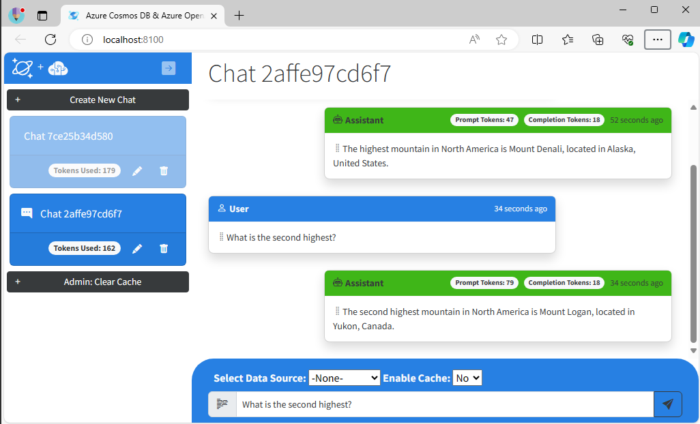

## Lab Introduction

In this hands-on lab we will show you how to design and build an application using Azure Cosmos DB for MongoDB and use its vector search capabilities combined with Azure OpenAI service to create a modern contextually rich Generative AI assistant experience working against the data you already have.

This hands-on lab will provide practical guidance on creating a RAG pattern application over transactional data, generating vectors and completions with Azure OpenAI Service, connecting to multiple vectorized data sources, managing chat history and enhancing performance with a semantic cache all orchestrated using Semantic Kernel. 

This session will equip you with the knowledge you need to elevate your AI application development skills.


## What are we doing?

This lab guides you through the steps to implement Generative AI capabilities in an ASP.NET Core Blazor web application leveraging the powerful vector search capabilities of Azure Cosmos DB for MongoDB and Azure OpenAI LLMs. 


These are the main tasks you will accomplish in this lab.
- Review a basic chat experience, forwarding user prompts to Azure OpenAI and surfacing the responses to the user interface, all the while storing this as chat history.
- Implement and test a chat history feature to allow for more natural conversational interactions using the chat history for context.
- Extend the functionality of your chat application based on a sample data set using Cosmos DB for MongoDB vector search capabilities and use this retrieved context implementing RAG architecture pattern.
-	(Optional) Implement and test a simple semantic cache for improved performance using the Semantic Kernel Connector for Cosmos DB for MongoDB.

# Prepare

You're updating an existing .NET solution that has an ASP.NET Blazor application as its sole project. This project includes service classes for Azure Cosmos DB and Azure OpenAI Service that need to connect to the deployed services in Azure.

Before moving to the next step, ensure you have completed the **Service Deployment** as well as the **Configuring a lab environment** in the [README File](../README.md).

## Getting going
So, let's have a quick look at the projects code and get started.
1.	Open **Visual Studio Code**, there is a link on the desktop or you can find it in the start menu. 
2.	Open the project folder **C:\Code\cosmosdb-mongo-copilot\src** , this is the app we are going to be working on. 

Let's build, run and review the application to verify that there are no issues before we make any modifications.
Let's build and run the application.
3.	Within **Visual Studio Code**, open a new terminal.


4. Copy the appsettings.json the project folder by running
```bash
Copy C:\Code\appSettings.json C:\Code\cosmosdb-mongo-copilot\SearchLab
```
5. Load the deployed Cosmos DB for MongoDB with the sample data
```bash
c:\MongoTools\MongoRestore.exe c:\MongoData\dump --config=c:\Code\MongoConfig.ini
```

6.	Build the application using the **dotnet build** command.
```bash
dotnet build
```
7.	You should see a **Build succeeded** message and **0 Error(s)** when it is complete.


8.	Run the application using the **dotnet run** command.
```bash
dotnet run
```
The output should look something similar to:


9.	You can **ctrl+click** on the URL that is part of **Now listening on http://localhost:8100** message you should see in the terminal window to open a browser and connect to the web application which is now running locally. Alternatively open the browser and navigate to http://localhost:8100.

You should see something that looks like this:


####Let's see what our assistant can do:
10.	Click the **Create New Chat** button, this will start a new chat session.
11. Let's ask a general knowledge question, `what is the deepest ocean?`


Great you have a working application and configuration.
You can see that the application is responding to the user prompts using the LLM and providing reasonable general knowledge responses.

Next we are going to drill into the detail of what makes this work.

===
# What is making our AI assistant work

Our application is composed of the following three services 
- The **ChatService** - this service is responsible for managing user interaction, chat logic and cross service coordination.
- The **SemanticKernel** service - this service is responsible for managing the interaction with the Azure OpenAI Service LLM using the Semantic Kernel.
- The **MonogDBService** service - this services provides access to the data stored in the Cosmos DB for MongoDB database.

### Exploring the main processing loop

Let's look at the method that is invoked when a user submits a prompt to the UI, *ProcessUserPrompt*

1.	Open the **Services/ChatService.cs** file.
2.	Locate the **ProcessUserPrompt** method and review the code. 

The **ProcessUserPrompt** method currently looks like:
```csharp
 public async Task<string> ProcessUserPrompt(string? sessionId, string prompt, string selectedCollectionName, string selectedCacheEnable)
 {
     try
     {
         ArgumentNullException.ThrowIfNull(sessionId);

         // Initialize variables
         string completion = "";                      // the output from our call to the LLM            
         List<Message> conversationContext = new();   // chat context to provide to the LLM
         string dataContext = "";                     // data context to provide to the LLM
         int promptTokens = 0;                        // the number of tokens for the prompt
         int completionTokens = 0;                    // the number of tokens for the completion
         bool cacheHit = false;


         // Handle UI input.
         string collectionName = await GetCollectionNameFromSelection(selectedCollectionName, prompt);
         bool cacheEnabled = (selectedCacheEnable == "yes") ? true : false;

         // Check if  cache  enabled and get a cache hit
         // add cache check code here

         if (true) // Prompt processing block
         {
             // Get conversation context
             //   code to get conversation context goes here

             // Get conversation embeddings
             //  code to get conversation embeddings goes here

             // Get RAG data context
             //  code to get RAG data context goes here

             // Get completion
             (completion, promptTokens, completionTokens) =
                 await _semanticKernelService.GetChatCompletionAsync(
                     conversationContext, dataContext, prompt);

             // Add entry to cache
             //  code for adding entry to cache goes here

         }

         //Create message with all prompt, response and meta data
         Message message = new Message(
                 sessionId: sessionId,
                 prompt: prompt,
                 promptTokens: promptTokens,
                 completion: completion,
                 completionTokens: completionTokens,
                 sourceSelected: selectedCollectionName,
                 sourceCollection: collectionName,
                 selectedCacheEnable, cacheHit);

         //Commit message 
         await AddPromptCompletionMessagesAsync(sessionId, message);

         return completion;
     }
     catch (Exception ex)
     {
         string message = $"ChatService.GetChatCompletionAsync(): {ex.Message}";
         _logger.LogError(message);
         throw;
     }
 }
```
ProcessUserPrompt is the primary method driving the application logic, handling the main prompt response loop with the *prompt*, *completion* and *sessionId* values driving most of the application behavior.

You will note the following about the ProcessUserPrompt method:

- It takes parameters for the *sessionId* and *prompt* from the user interface 
- A completion is generated to send back to the user by calling *_semanticKernelService.GetChatCompletionAsync*
- Both the prompt and completion are stored in a new *message* instance of the Message class.
- The *message* is saved to our database and updates the user interface by calling the *AddPromptCompletionMessagesAsync* method.

You will also note that the framework for the additional code needed to develop the application end to end are provided as placeholder comments throughout this method.

For now, ignore other defined place holder variables and parameters, their usefulness will become more evident as we work through the lab.


### Connecting to Azure Open AI with Semantic Kernel

Let's now have a look at the method that call to get back the completions from our main processing loop, *GetChatCompletionAsync*

3. Open the **Services/SemanticKernel.cs** file.
4. Locate the **GetChatCompletionAsync** method.
5. Review the code which looks like this:

```csharp
public async Task<(string? response, int promptTokens, int responseTokens)>
        GetChatCompletionAsync(List<Message> conversationMessages, string RAGContext, string prompt)
{
    try
    {
        var response = "";
        var promptTokens = 0;
        var completionTokens = 0;

        // Construct chatHistory
        string systemPrompt = _simpleSystemPrompt;
        ChatHistory chatHistory = new ChatHistory();
        chatHistory.AddSystemMessage(systemPrompt);
        
            //Add code to include conversationMesssages to chat context

        chatHistory.AddUserMessage(prompt);

        // Construct settings 
        OpenAIPromptExecutionSettings settings = new();
        settings.Temperature = 0.2;
        settings.MaxTokens = _maxCompletionTokens;
        settings.TopP = 0.7;
        settings.FrequencyPenalty = 0;
        settings.PresencePenalty = -2;

        // Get Completion
        var result = await kernel.GetRequiredService<IChatCompletionService>()
                        .GetChatMessageContentAsync(chatHistory, settings);
        response = result.Items[0].ToString();

        // Get Token usage
        CompletionsUsage completionUsage = (CompletionsUsage)result.Metadata["Usage"];
        promptTokens = completionUsage.PromptTokens;
        completionTokens = completionUsage.CompletionTokens;

        return (
         response: response,
         promptTokens: promptTokens,
         responseTokens: completionTokens
         );

    }
    catch (Exception ex)
    {

        string message = $"OpenAiService.GetChatCompletionAsync(): {ex.Message}";
        _logger.LogError(message);
        throw;

    }
}
```

The *GetChatCompletionAsync* is used to setup the requirements to call the Semantic Kernel *GetChatMessageContentAsync* method.

You will note the following about the *GetChatCompletionAsync* method:

- It takes parameters for the *prompt* (the other parameters will be used to provide additional context to the completion call later in the lab).
- Constructs a *chatHistory* instance of the Semantic Kernel ChatHistory class.
    - It adds a system prompt to *chatHistory* as a system message
    - It adds the *prompt* to the *chatHistory* sa a user message.
- It constructs a *settings* instance and sets a number of parameters that control the completion call behavior. 
- It calls the *GetChatMessageContentAsync* method on the Semantic Kernel initialized in the service constructor (we will have a look at that next).
- It extracts the *promptTokens and completionTokens* of the prompt and completion from the result of the call to *GetChatMessageContentAsync*
- It returns the completion and tokens to the caller as a tuple. 

You will likely now be interested in understanding how the *kernel* instance used in *GetChatCompletionAsync* is constructed. 

6. Locate the **SemanticKernelService** constructor method within the **Services/SemanticKernel.cs** file.
7. Locate the section which initializes the Semantic Kernel and looks like this:
```csharp
       // Initialize the Semantic Kernel
       var kernelBuilder = Kernel.CreateBuilder();
       kernelBuilder.AddAzureOpenAIChatCompletion(
           semanticKernelOptions.CompletionsDeployment,
           semanticKernelOptions.Endpoint,
           semanticKernelOptions.Key);
       kernelBuilder.AddAzureOpenAITextEmbeddingGeneration(
           semanticKernelOptions.EmbeddingsDeployment,
           semanticKernelOptions.Endpoint,
           semanticKernelOptions.Key);
       kernel = kernelBuilder.Build();
```

The Semantic Kernel uses a pluggable connector architecture that allows us to compose the  required connector modules for the functionality we require. Here the *KernelBuilder is used to build a *Kernel* with the **Azure Open AI Chat Completion Connector** and the **Azure Open AI Text Embedding Generation Connector**.

You will note that each connector is provided with the appropriate service settings defined in the projects appsettings.json file.

That it for the review, you should now have a solid understanding of the code driving the application functionality.

Next we will explore some of the limits of this application and how to address them. 


# Giving our AI assistant context

We have the basics for our Generative AI chat application in place. Let's explore how well it responds to natural language interactions.

## Test contextual follow up questions

Humans interact with each other through conversations that have some context of what is being discussed. LLMs based applications can be built to  interact in this way but this capability, it needs to be implemented by the application developer. 

Let's explore what happens when we test the LLM with follow-up questions in our conversation

1. If you shutdown the app, return to the terminal window and start the application using **dotnet run** 

    ```bash
    dotnet run
    ```
2. Open your browser to http://localhost:8100, remember that you can always use tYou can **ctrl+click** on the URL that is part of **Now listening on http://localhost:8100** in the terminal window.

3. In the web application, create a new chat session and ask the AI assistant the same question again, `What is the highest mountain in North America?` and wait for the response. The answer will be "Mount Denali, also known as Mount McKinley," with some additional information. 

    

4. Ask the follow-up question, `What is the second highest?`. The response generated would likely look like the one below, having nothing to do with your first question, or the LLM may respond that it doesn't understand your question.

    
    

What you are observing is the fact that LLM's are stateless. They do not by themselves maintain any conversation history and therefore would be missing the context necessary for them to respond appropriately to the second question.

5. Close the application browser window
6. Return to the terminal window and stop the application by pressing Ctrl+C

In this exercise we will show how to implement chat history, often called a **Chat Context Window** for a Generative AI application. We will also explain the concept of tokens for an LLM and why these are important to consider when implementing a context window.


## What are tokens and why do they matter?
Large language model **tokens**  refer to the basic units of text processed by the model. These tokens can represent words, parts of words or even punctuation marks, depending on the tokenization method used in that specific model (on average 1 token is equivalent to 4 characters).

Tokens are used to meter, provision and rate limit access to large language models to manage and optimize resource allocation, ensure fair usage and control costs. Given this, a token is not just a unit of text  but serves as a measure of the computational resources needed for processing of an input text or generating output text.

Large language models require chat history to generate contextually relevant results. But there is a limit on how much text you can send as large language models given that they limit the tokens for each request and response pair and as a result their use needs to be well managed. Managing tokens can be challenging as you need to ensure sufficient context is provided for the LLM to generate a relevant response whilst simultaneously ensuring that there are sufficient tokens for the response. Failing to find the correct balance can lead to incomplete results or unexpected behavior.


## Building a chat context window using tokens

7. Open the **Services/ChatService.cs** file.
8. Locate the **GetConversationContext** method.

The *GetConversationContext* method will look like this:
```csharp
private List<Message> GetConversationContext(
    string sessionId, int maxConverstionTokens)
{
    // conversationMessages contains an ordered list of all conversation messsages for a session
    int index = _sessions.FindIndex(s => s.SessionId == sessionId);
    List<Message> conversationMessages = _sessions[index]
        .Messages
        .OrderByDescending(m => m.TimeStamp)
        .ToList();

    List<Message> trimmedMessages = new List<Message>();

    //Tokenize and trim conversation history based on tokens
    // add code to tokenize and trim context

    return trimmedMessages.Reverse<Message>().ToList();

}
```
You will note that the *GetConversationContext* method currently:
- It retrieves an ordered list of *conversationMessages* based on the timestamp
- It returns an empty list of *trimmedMessages*

This method needs to return a list of *trimmedMessages* based on the most recent *conversationMessages* that fit with the token limit provided by the  *MaxConversationTokens* parameter.

9. Replace the placeholder "//Tokenize and trim .." comments with the following code:

```csharp
    //Tokenize and trim conversation history based on tokens
    int totalTokens = 0;
    foreach ( var message in conversationMessages)
    {
        var messageTokens = tokenizer.CountTokens(message.Prompt) + tokenizer.CountTokens(message.Completion);
        if ((totalTokens+ messageTokens)> maxConverstionTokens)
            break;
        totalTokens= totalTokens + messageTokens;
        trimmedMessages.Add(message);
    }
```

This code:
- Iterates through the *conversationMessages* and copies them into *trimmedMessages*
- Gets the estimated tokens for the prompt and completion using an *tokenizer* instance of the Microsoft ML tokenizer and accumulates these to *totalTokens*
- Exits the copy process when the *totalTokens* is the next messages tokens short of the *maxConverstionTokens 

Tokenizers are useful in that they can estimate the tokens in a manner consistent with how a specific model would tokenize without the need to call the LLM directly using client compute resources.

The *GetConversationContext* should now look like this:
```csharp
private List<Message> GetConversationContext(
    string sessionId, int maxConverstionTokens)
{
    // conversationMessages contains an ordered list of all conversation messsages for a session
    int index = _sessions.FindIndex(s => s.SessionId == sessionId);
    List<Message> conversationMessages = _sessions[index]
        .Messages
        .OrderByDescending(m => m.TimeStamp)
        .ToList();

    List<Message> trimmedMessages = new List<Message>();

    //Tokenize and trim conversation history based on tokens
    int totalTokens = 0;
    foreach (var message in conversationMessages)
    {
        var messageTokens = tokenizer.CountTokens(message.Prompt) + tokenizer.CountTokens(message.Completion);
        if ((totalTokens + messageTokens) > maxConverstionTokens)
            break;
        totalTokens = totalTokens + messageTokens;
        trimmedMessages.Add(message);
    }

    return trimmedMessages.Reverse<Message>().ToList();

}
```

10. Locate the **ProcessUserPrompt** method within **ChatService.cs** 

11. Replace the placeholder "// Get conversation context ..." comments with the following code:

```csharp
// Get conversation context
conversationContext = GetConversationContext(sessionId,_semanticKernelService.MaxConversationTokens);
```
This calls the *GetConversationContext* method and stores the result in *conversationContext* which is then passed to the call to *GetChatCompletionAsync*

The *ProcessUserPrompt* should now look like this:

```csharp
public async Task<string> ProcessUserPrompt(string? sessionId, string prompt, string selectedCollectionName, string selectedCacheEnable)
{
    try
    {
        ArgumentNullException.ThrowIfNull(sessionId);

        // Initialize variables
        string completion = "";                      // the output from our call to the LLM            
        List<Message> conversationContext = new();   // chat context to provide to the LLM
        string dataContext = "";                     // data context to provide to the LLM
        int promptTokens = 0;                        // the number of tokens for the prompt
        int completionTokens = 0;                    // the number of tokens for the completion
        bool cacheHit = false;


        // Handle UI input.
        string collectionName = await GetCollectionNameFromSelection(selectedCollectionName, prompt);
        bool cacheEnabled = (selectedCacheEnable == "yes") ? true : false;

        // Check if  cache  enabled and get a cache hit
        // add cache check code here

        if (true) // Prompt processing block
        {
            // Get conversation context
            conversationContext = GetConversationContext(sessionId, _semanticKernelService.MaxConversationTokens);

            // Get conversation embeddings
            //  code to get conversation embeddings goes here

            // Get RAG data context
            //  code to get RAG data context goes here

            // Get completion
            (completion, promptTokens, completionTokens) =
                await _semanticKernelService.GetChatCompletionAsync(
                    conversationContext, dataContext, prompt);

            // Add entry to cache
            //  code for adding entry to cache goes here

        }

        //Create message with all prompt, response and meta data
        Message message = new Message(
                sessionId: sessionId,
                prompt: prompt,
                promptTokens: promptTokens,
                completion: completion,
                completionTokens: completionTokens,
                sourceSelected: selectedCollectionName,
                sourceCollection: collectionName,
                selectedCacheEnable, cacheHit);

        //Commit message 
        await AddPromptCompletionMessagesAsync(sessionId, message);

        return completion;
    }
    catch (Exception ex)
    {
        string message = $"ChatService.GetChatCompletionAsync(): {ex.Message}";
        _logger.LogError(message);
        throw;
    }
}
```

12. Save **ChatService.cs** 

13. Open the **Services/SemanticKernel.cs** file. 
14. Locate the **GetChatCompletionAsync** method
15. Replace place the placeholder "// //Add code to include conversationMesssages .." comment with the following code:
```csharp
 foreach (var message in conversationMessages)
 {
     chatHistory.AddUserMessage(message.Prompt);
     chatHistory.AddAssistantMessage(message.Completion);
 }
```
This code iterates through the *conversationMessages* and adds them to the chat history 

The *GetChatCompletionAsync* should now look like this:
```csharp
public async Task<(string? response, int promptTokens, int responseTokens)>
        GetChatCompletionAsync(List<Message> conversationMessages, string RAGContext, string prompt)
{
    try
    {
        var response = "";
        var promptTokens = 0;
        var completionTokens = 0;

        // Construct chatHistory
        string systemPrompt = _simpleSystemPrompt;
        ChatHistory chatHistory = new ChatHistory();
        chatHistory.AddSystemMessage(systemPrompt);
        foreach (var message in conversationMessages)
        {
            chatHistory.AddUserMessage(message.Prompt);
            chatHistory.AddAssistantMessage(message.Completion);
        }
        chatHistory.AddUserMessage(prompt);


        // Construct settings 
        OpenAIPromptExecutionSettings settings = new();
        settings.Temperature = 0.2;
        settings.MaxTokens = _maxCompletionTokens;
        settings.TopP = 0.7;
        settings.FrequencyPenalty = 0;
        settings.PresencePenalty = -2;

        // Get Completion
        var result = await kernel.GetRequiredService<IChatCompletionService>()
            .GetChatMessageContentAsync(chatHistory, settings);
        response = result.Items[0].ToString();

        // Get Token usage
        CompletionsUsage completionUsage = (CompletionsUsage)result.Metadata["Usage"];
        promptTokens = completionUsage.PromptTokens;
        completionTokens = completionUsage.CompletionTokens;

        return (
         response: response,
         promptTokens: promptTokens,
         responseTokens: completionTokens
         );

    }
    catch (Exception ex)
    {

        string message = $"OpenAiService.GetChatCompletionAsync(): {ex.Message}";
        _logger.LogError(message);
        throw;

    }
}
```
16. Save **SemanticKernel.cs** 

17. In the terminal and start the application using **dotnet run** and open your browser to http://localhost:8100

18. Let see if adding context helped when we try those same questions again.
In the web application, create a new chat session and ask the AI assistant the same question again, `What is the highest mountain in North America?`. And wait for the response stating that it is Mount Denali, also known as Mount McKinley.

19. Now ask the follow up question. `What is the second highest?`. The response generated is now going to be in response to the question with the context of mountains in North America and should be Mount Logan.



Well done! We now have a AI assistant that is aware of the conversation context 

20. Close the application browser window
21. Return to the terminal window and stop the application by pressing Ctrl-C

Next we will explore adding context from other data sources.

===
# Adding additional data for AI assistant context 

We now have a have an AI assistant chat application that can leverage conversation context. We want more than that - we want our AI assistant to act with an understanding of our transactional data - the data that currently underpins our applications. 

For todays lab you will be using the Cosmic Works retail dataset which contains product, customer and sales data which is an adapted subset of the Adventure Works 2017 dataset.

## What is RAG and why vector search
RAG is an acronym for Retrieval Augmented Generation, an architecture for providing additional context data to our large language model to use when generating a completions.

Vector search plays a crucial role in the RAG architecture, enabling efficient retrieval of relevant information from a large dataset. In a RAG architecture, both the input query text and all the documents in the target dataset are transformed into vectors in a high-dimensional space using embeddings generated through models that capture the semantic meaning of their content Vector search utilizes these embeddings by calculating the similarity between the vector of the query and the vectors of the documents allowing for the identification records that are contextually relevant to the query, enabling queries that go well beyond simple keyword matching.

Another advantage of Vector search-based architecture is that it allows records to be updated or added and continues to perform effectively as data grows and changes over time.

## Extending our app to support RAG

There are four key elements to implementing the RAG pattern in our application
- Generating embeddings vectors for our dataset
- Generating vectors on our prompt context, 
- Searching the dataset using the stored vectors to retrieve appropriate context data
- Generating completions based on this context. 

For the sample dataset we are using today:
- The data is stored in collections within Azure Cosmos DB for MongoDB
- The data hs embedding vectors already generated and store in each document in a proprert named *embedding*.
- The collections are indexed with a vector index

## Generating the prompt embedding

1. Open the **Services/SemanticKernel.cs** file.

2. Locate the **GetEmbeddingsAsync** 

3. Replace the code block below the "// Generate embeddings" comment with the following code:

```csharp
// Generate embeddings
var embeddings = await kernel.GetRequiredService<ITextEmbeddingGenerationService>()
    .GenerateEmbeddingAsync(input);
float[] embeddingsArray = embeddings.ToArray();
```
The method now calls *GenerateEmbeddingAsync* method on the Semantic Kernel initialized in the service constructor we looked at previous, passing in the *input* string and returning  the embeddings as an array. 

The the GetEmbeddingsAsync method should now look like:
```csharp
public async Task<(float[] vectors, int embeddingsTokens)>
    GetEmbeddingsAsync(string input)
{
    try
    {
        // Generate embeddings
        var embeddings = await kernel.GetRequiredService<ITextEmbeddingGenerationService>()
            .GenerateEmbeddingAsync(input);
        float[] embeddingsArray = embeddings.ToArray();


        int responseTokens = 0;
        return (embeddingsArray, responseTokens);
    }
    catch (Exception ex)
    {
        string message = $"SemanticKernel.GetEmbeddingsAsync(): {ex.Message}";
        _logger.LogError(message);
        throw;

    }
}
```

4. Save the **Services/SemanticKernel.cs** file.

5. Within the **ChatService.cs** class
6. locate the **ProcessUserPrompt** method. 
7. Replace the "// Get conversation embeddings" comments with the following code

```csharp
 // Get conversation embeddings
 (float[] promptConversationVectors, int promptConversationTokens)
     = await _semanticKernelService.GetEmbeddingsAsync(
         GetConversationStringFromMessages(conversationContext, prompt));
```
This calls the *GetEmbeddingsAsync* method passing in a string representation of the *conversationContext* and including the *prompt* and returns the embedding vector array. A helper method *GetConversationStringFromMessages* is used to convert the *conversationContext* messages into string format. 

The @ProcessUserPrompt method now looks like this:

```csharp
public async Task<string> ProcessUserPrompt(string? sessionId, string prompt, string selectedCollectionName, string selectedCacheEnable)
{
    try
    {
        ArgumentNullException.ThrowIfNull(sessionId);

        // Initialize variables
        string completion = "";                      // the output from our call to the LLM            
        List<Message> conversationContext = new();   // chat context to provide to the LLM
        string dataContext = "";                     // data context to provide to the LLM
        int promptTokens = 0;                        // the number of tokens for the prompt
        int completionTokens = 0;                    // the number of tokens for the completion
        bool cacheHit = false;


        // Handle UI input.
        string collectionName = await GetCollectionNameFromSelection(selectedCollectionName, prompt);
        bool cacheEnabled = (selectedCacheEnable == "yes") ? true : false;

        // Check if  cache  enabled and get a cache hit
        // add cache check code here

        if (true) // Prompt processing block
        {
            // Get conversation context
            conversationContext = GetConversationContext(sessionId, _semanticKernelService.MaxConversationTokens);

            // Get conversation embeddings
            (float[] promptConversationVectors, int promptConversationTokens)
                = await _semanticKernelService.GetEmbeddingsAsync(
                    GetConversationStringFromMessages(conversationContext, prompt));


            // Get RAG data context
            //  code to get RAG data context goes here

            // Get completion
            (completion, promptTokens, completionTokens) =
                await _semanticKernelService.GetChatCompletionAsync(
                    conversationContext, dataContext, prompt);

            // Add entry to cache
            //  code for adding entry to cache goes here

        }

        //Create message with all prompt, response and meta data
        Message message = new Message(
                sessionId: sessionId,
                prompt: prompt,
                promptTokens: promptTokens,
                completion: completion,
                completionTokens: completionTokens,
                sourceSelected: selectedCollectionName,
                sourceCollection: collectionName,
                selectedCacheEnable, cacheHit);

        //Commit message 
        await AddPromptCompletionMessagesAsync(sessionId, message);

        return completion;
    }
    catch (Exception ex)
    {
        string message = $"ChatService.GetChatCompletionAsync(): {ex.Message}";
        _logger.LogError(message);
        throw;
    }
}
```
8. Save **ChatService.cs** 

## Performing the vector search

9. Open the **Services/MongoDbService.cs** file.
10. Locate the **VectorSearchAsync**  method.
11. Replace the code block below "// Perform vector search ..." comments with the following code.
```csharp
 // Connect to collection
 IMongoCollection<BsonDocument> collection = _database.GetCollection<BsonDocument>(collectionName);

 // Convert embeddings to BSON array
 var embeddingsArray = new BsonArray(embeddings.Select(e => new BsonDouble(Convert.ToDouble(e))));

 // Define MongoDB pipeline query
 BsonDocument[] pipeline = new BsonDocument[]
 {
     new BsonDocument
     {
         {
             "$search", new BsonDocument
             {
                 {
                     "cosmosSearch", new BsonDocument
                     {
                         { "vector", embeddingsArray },
                         { "path", path },
                         { "k", _maxVectorSearchResults }
                     }
                 },
                 { "returnStoredSource", true }
             }
         }
     },
     new BsonDocument
     {
         {
             "$project", new BsonDocument
             {
                 {"_id", 0 },
                 {path, 0 },
             }
         }
     }
 };

 // Execute query 
 List<BsonDocument> bsonDocuments = await collection.Aggregate<BsonDocument>(pipeline).ToListAsync();
 List<string> textDocuments = bsonDocuments.ConvertAll(bsonDocument => bsonDocument.ToString());

 // Tokenize and limit to maxTokens 
 var totalTokens = 0;
 foreach (var document in textDocuments)
 {
     var tokens = _tokenizer.CountTokens(document);
     if ((totalTokens + tokens) > maxTokens)
     {
         break;
     }
     totalTokens += tokens;
     resultDocuments = resultDocuments + "," + document;
 }
```
This code:
- Connects to the specified collection using *collectionName*
- Converts the query embeddings in *embeddings* to BSON for use in the query
- Defines vector query and stores it in pipeline
- Executes the vector query using the MongoDB SDK in the same manner as any typical MongoDB pipeline query
- Converts the BSON result into *textDocuments* list of strings
- Iterates over and tokenizes *textDocuments* and limits the returned *resultDocuments* based on the *maxTokens*, using an approach similar that used to tokenize and limit the chat context.

The *VectorSearchAsync* method should now look like:
```csharp
public async Task<string> VectorSearchAsync(string collectionName, string path, float[] embeddings, int maxTokens)
{
    try
    {
        string resultDocuments = "[";

        // Connect to collection
        IMongoCollection<BsonDocument> collection = _database.GetCollection<BsonDocument>(collectionName);

        // Convert embeddings to BSON array
        var embeddingsArray = new BsonArray(embeddings.Select(e => new BsonDouble(Convert.ToDouble(e))));

        // Define MongoDB pipeline query
        BsonDocument[] pipeline = new BsonDocument[]
        {
 new BsonDocument
 {
     {
         "$search", new BsonDocument
         {
             {
                 "cosmosSearch", new BsonDocument
                 {
                     { "vector", embeddingsArray },
                     { "path", path },
                     { "k", _maxVectorSearchResults }
                 }
             },
             { "returnStoredSource", true }
         }
     }
 },
 new BsonDocument
 {
     {
         "$project", new BsonDocument
         {
             {"_id", 0 },
             {path, 0 },
         }
     }
 }
        };

        // Execute query 
        List<BsonDocument> bsonDocuments = await collection.Aggregate<BsonDocument>(pipeline).ToListAsync();
        List<string> textDocuments = bsonDocuments.ConvertAll(bsonDocument => bsonDocument.ToString());

        // Tokenize and limit to maxTokens 
        var totalTokens = 0;
        foreach (var document in textDocuments)
        {
            var tokens = _tokenizer.CountTokens(document);
            if ((totalTokens + tokens) > maxTokens)
            {
                break;
            }
            totalTokens += tokens;
            resultDocuments = resultDocuments + "," + document;
        }


        resultDocuments = resultDocuments + "]";
        return resultDocuments;
    }
    catch (MongoException ex)
    {
        _logger.LogError($"Exception: VectorSearchAsync(): {ex.Message}");
        throw;
    }

   
}
```
12. Save the **Services/MongoDBService.cs** file.

13. Within the **ChatService.cs** class
14. Locate the **ProcessUserPrompt** 
15. Replace the "// Get RAG data context" comments with the following code:

```csharp
// Get RAG data context
                if (collectionName != "none")
                    dataContext = await _mongoDbService.VectorSearchAsync(
                            collectionName, "embedding",
                            promptConversationVectors, _semanticKernelService.MaxContextTokens);

```
This code calls the *VectorSearchAsync* method if a valid collectionName is provided, storing the result of the vector query in *dataContext*.

The *ProcessUserPrompt* method should now look like this:
```csharp
public async Task<string> ProcessUserPrompt(string? sessionId, string prompt, string selectedCollectionName, string selectedCacheEnable)
{
    try
    {
        ArgumentNullException.ThrowIfNull(sessionId);

        // Initialize variables
        string completion = "";                      // the output from our call to the LLM            
        List<Message> conversationContext = new();   // chat context to provide to the LLM
        string dataContext = "";                     // data context to provide to the LLM
        int promptTokens = 0;                        // the number of tokens for the prompt
        int completionTokens = 0;                    // the number of tokens for the completion
        bool cacheHit = false;


        // Handle UI input.
        string collectionName = await GetCollectionNameFromSelection(selectedCollectionName, prompt);
        bool cacheEnabled = (selectedCacheEnable == "yes") ? true : false;

        // Check if  cache  enabled and get a cache hit
        // add cache check code here

        if (true) // Prompt processing block
        {
            // Get conversation context
            conversationContext = GetConversationContext(sessionId, _semanticKernelService.MaxConversationTokens);

            // Get conversation embeddings
            (float[] promptConversationVectors, int promptConversationTokens)
                = await _semanticKernelService.GetEmbeddingsAsync(
                    GetConversationStringFromMessages(conversationContext, prompt));


            // Get RAG data context
                if (collectionName != "none")
                    dataContext = await _mongoDbService.VectorSearchAsync(
                            collectionName,
                             "embedding",
                            promptConversationVectors,_semanticKernelService.MaxContextTokens);

            // Get completion
            (completion, promptTokens, completionTokens) =
                await _semanticKernelService.GetChatCompletionAsync(
                    conversationContext, dataContext, prompt);

            // Add entry to cache
            //  code for adding entry to cache goes here

        }

        //Create message with all prompt, response and meta data
        Message message = new Message(
                sessionId: sessionId,
                prompt: prompt,
                promptTokens: promptTokens,
                completion: completion,
                completionTokens: completionTokens,
                sourceSelected: selectedCollectionName,
                sourceCollection: collectionName,
                selectedCacheEnable, cacheHit);

        //Commit message 
        await AddPromptCompletionMessagesAsync(sessionId, message);

        return completion;
    }
    catch (Exception ex)
    {
        string message = $"ChatService.GetChatCompletionAsync(): {ex.Message}";
        _logger.LogError(message);
        throw;
    }
}
```

16. Save the **ChatService.cs** file.

## Performing the chat completion

17. Open the **Services/SemanticKernel.cs** file 
18. Locate the **GetChatCompletionAsync** method 

19. Replace the ``` string systemPrompt = _simpleSystemPrompt;``` statement with ``` string systemPrompt = _cosmicSystemPrompt + RAGContext;```

This will change the system prompt to one that refers to an appended JSON formated *RAGContext* dataset. In essesence this embededs the data we retrived from the vector search into the system prompt allowing the rest of the chat to directly reference it.

The final *GetChatCompletionAsync* method should look like:
```csharp
 public async Task<(string? response, int promptTokens, int responseTokens)>
     GetChatCompletionAsync(List<Message> conversationMessages, string RAGContext, string prompt)
 {
     try
     {
         var response = "";
         var promptTokens = 0;
         var completionTokens = 0;

         //Construct chatHistory
         string systemPrompt = _cosmicSystemPrompt + RAGContext;
         ChatHistory chatHistory = new ChatHistory();
         chatHistory.AddSystemMessage(systemPrompt);
         foreach (var message in conversationMessages)
         {
             chatHistory.AddUserMessage(message.Prompt);
             chatHistory.AddAssistantMessage(message.Completion);
         }
         chatHistory.AddUserMessage(prompt);


         //Construct settings 
         OpenAIPromptExecutionSettings settings = new();
         settings.Temperature = 0.2;
         settings.MaxTokens = _maxCompletionTokens;
         settings.TopP = 0.7;
         settings.FrequencyPenalty = 0;
         settings.PresencePenalty = -2;

         // Get Completion
         var result = await kernel.GetRequiredService<IChatCompletionService>()
             .GetChatMessageContentAsync(chatHistory, settings);
         response = result.Items[0].ToString();
         
         // Get Token usage
         CompletionsUsage completionUsage = (CompletionsUsage)result.Metadata["Usage"];
         promptTokens = completionUsage.PromptTokens;
         completionTokens = completionUsage.CompletionTokens;

         return (
          response: response,
          promptTokens: promptTokens,
          responseTokens: completionTokens
          );

     }
     catch (Exception ex)
     {

         string message = $"OpenAiService.GetChatCompletionAsync(): {ex.Message}";
         _logger.LogError(message);
         throw;

     }
 }
``` 
20. Locate the **_cosmicSystemPrompt** class property within **Services/SemanticKernel.cs** to review the system prompt that is now being used by *GetChatCompletionAsync*.

```csharp
    private readonly string _cosmicSystemPrompt = @"
     You are an intelligent assistant for the Cosmic Works Bike Company. 
     You are designed to provide helpful answers to user questions about
     product, product category, customer and sales order information 
     provided in JSON format in the below context information section.

     Context information:";
``` 
You can see that this system prompt now prompts the LLM for a response that also includes reference to the concatenated JSON data retrieved by the vector search. 

21. Save the **SemanticKernel.cs** file.


## Bring our data to life

22. If you have not shutdown your app do so now the terminal and start the application using **dotnet run** and open your browser to http://localhost:8100

Your chat should still function the way it used and provide and support conversational context when the data source selector is set to 'none'

23. In the web application, create a new chat session and ask the AI assistant `Whats the deepest ocean?`. And wait for the response, "the Pacific Ocean" with some additional information. 

24. Ask this follow up question. `What the second deepest?`, just throwing in a small grammar mistake to make it a little harder. And the response is "the Atlantic Ocean"


25. Create a new chat session, set the data source to **products** and let's ask it something about the products that Cosmic Works sells. `What mountain bikes are available?`


26. Create a new chat session, set the data source to **customers** and let's ask it something about a customer, maybe she just introduced herself and I want to send her an email `What is Nancy Hirota's email address` and lets follow that up with a questions that requires conversational context `what details do you have for her`


27. Close the application browser window
28. Return to the terminal window and stop the application by pressing Ctrl+C

Congratulations!
We you met one of our key objectives: You have created an intelligent AI chat assistant that can leverage our data to provide contextually aware answers.

===
# Exercise:  Implement a Semantic Cache

Large language models are amazing with their ability to generate completions to a user's prompts. However, these requests to generate completions from an LLM are computationally expensive (token hungry), and can also be quite slow. As you would have seen from the previous exercise token cost and latency increases as the amount of context we provide increases. 

Using a similar *RAG Pattern* to that which you used in the previous exercise to enhance the LLM calls with contextual data from transactional data sources, the persisted conversation history can be used as a source over which to perform vector queries. By generating an embedding of the provided prompt and using a vector search to identify and return completions from previous historic conversations that closely match the meaning of the prompt we can create an effective cache for some scenarios. This type of specialized cache can be referred to as a **semantic cache** and often exceeds the performance of simple keyword matching using on a key-value store traditionally used.  

Using Sematic Kernel extensibility framework interfaces allow it to flexibly integrate any AI service and data stores through a set of connectors that make it easy to add memories in addition to the AI models we have used thus far. With the introduction of the **Semantic Kernel Memory Connector for Cosmos DB for MongoDB** we have a plug and play method of implementing our sematic cache. 

Let's build our semantic cache using Semantic Kernel memory.

1. Open the **Services/SemanticKernel.cs** file.
2. Locate the **SemanticKernelService** constructor method.
3. Locate the section which initializes the Semantic Kernel *memoryStore* and *memory* objects.
4. Review the  memoryStore and memory initialization code that looks like this:
```csharp
// Build Sematic Kernel memory with Cosmos DB for MongoDB connector
AzureCosmosDBMongoDBConfig memoryConfig = new(1536);
memoryConfig.Kind = AzureCosmosDBVectorSearchType.VectorHNSW;

memoryStore = new(
    mongoDbOptions.Connection,
    mongoDbOptions.DatabaseName,
    memoryConfig);

memory = new MemoryBuilder()
        .WithAzureOpenAITextEmbeddingGeneration(
            semanticKernelOptions.EmbeddingsDeployment,
            semanticKernelOptions.Endpoint,
            semanticKernelOptions.Key)
        .WithMemoryStore(memoryStore)
        .Build();
```

This code:
- Initializes a Semantic Kernel *memoryStore* using the provided constructor parameters for connection string and database name from the appsettings configuration and the Cosmos DB for MongoDB *memoryConfig* through which the vector size and index type are specified.
- Initializes a Sementic Kernel *memory* using the MemoryBuilder where we provide it with the Azure Open AI model connector along with the service details for embedding generation and the *memoryStore* for storage. 

Just like that we have a database service backed memory store that will automatically  generate embeddings and provides the ability to run vector queries directly through the Semantic Kernel SDK.

5. Locate the **AddCachedMemory**  method within the **SemanticKernel.cs** file.
6. Replace the code block below " //Save prompt and completion to memory" comments with the following code
```csharp
//Save prompt and completion to memory
await memory.SaveInformationAsync("cache", promptText, Guid.NewGuid().ToString(), additionalMetadata: completionText);
```
This code uses the *SaveInformationAsync* method call to save the *promptText*, new GUID as a unique identifier and the *completionText* to the "cache" memory collection which is automatically backed by a Cosmos DB for MongoDB collection. 

The *AddCachedMemory* method should now look like:
```csharp
 public async Task AddCachedMemory(string promptText, string completionText)
 {
     await memory.SaveInformationAsync("cache", promptText, Guid.NewGuid().ToString(), additionalMetadata: completionText);
 }
 ```
 
7. Locate the **CheckCache**  method within the **SemanticKernel.cs** file.
8. Replace the code block below "//Search memory for userPrompt" comments with the following code:
```csharp
  //Search memory for userPrompt
  var memoryResults = memory.SearchAsync(
          "cache",
          userPrompt,
          limit: 1, minRelevanceScore: 0.95);
  await foreach (var memoryResult in memoryResults)
  {
      cacheResult = cacheResult + memoryResult.Metadata.AdditionalMetadata.ToString();
  }
```
This code uses the *SearchAsync* method call to retrieve the most relavant *cacheResult* completion for the *userPrompt* with a minRelevanceScore of 0.95.

The minRelevanceScore is a measure of similarity in how close the user's intent and words are to the those stored in the cache. The greater the score, the more similar the words and intent. The lower the score, the less similar the words *and potentially* intent as well.
In practice, choosing  this value can be tricky. Too high, and the cache will quickly fill up with multiple responses for very similar questions. Too low, and the cache will return irrelevant responses that do not satisfy the user. The choice of this value is also highly dependent on the scenario. 

The *CheckCache* method should now look like:
```csharp
    public async Task<string> CheckCache(string userPrompt)
    {
        string cacheResult = string.Empty;

        //Search memory for userPrompt
        var memoryResults = memory.SearchAsync(
                "cache",
                userPrompt,
                limit: 1, minRelevanceScore: 0.95);
        await foreach (var memoryResult in memoryResults)
        {
            cacheResult = cacheResult + memoryResult.Metadata.AdditionalMetadata.ToString();
        }

        return cacheResult;
    }

 ```

9. Locate the **ClearCacheAsync**  method within the **SemanticKernel.cs** file.
10. Replace the code block below "// Clear cache by deleting... " comments with the following code:

```csharp
   // Clear cache by deleting memory store collection
    await memoryStore.DeleteCollectionAsync("cache");
```
This code deletes the cache collection memory store and Cosmos DB for MongoDB persisted data.

The *ClearCacheAsync* method should now look like:
```csharp
public async Task ClearCacheAsync()
{
    // Clear cache by deleting memory store collection
    await memoryStore.DeleteCollectionAsync("cache");
}
```
11. Save the **SemanticKernel.cs** file.

12. Open the **Services/ChatService.cs** file.
13. Locate the **ProcessUserPrompt** method
14. Replace the "// Check if  cache  enabled ..." with the following code:
```csharp
/// Check if  cache  enabled and get a cache hit
if (cacheEnabled)
{
    completion = await _semanticKernelService.CheckCache(prompt);
    cacheHit = (completion != string.Empty);
}

```
This code calls the *CheckCache* method on the SemanticKernelService which returns a result of a single highly semantically related completion, or an empty string is the was not match with sufficent relavancy. The presence of an empty *cacheCompletion* is used to set the *cacheHit* variable.

15. Replace the ``` if (true) ``` statement  with ``` if (!cacheHit) ``` statement.
This code uses the value of *cacheHit*  to decide if the entire prompt processing block should be run, in the case of a cache miss, or if the cacheCompletion can be returned directly to the user.

16. Replace the "// Add entry to cache ..." comments with the following code:
```csharp
//Add entry to cache
await _semanticKernelService.AddCachedMemory(prompt, completion);
```
This code calls the *AddCachedMemory* method on the SemanticKernelService to add the prompt and completion the cache.

The *ProcessUserPrompt* method should now look like this:
```csharp
public async Task<string> ProcessUserPrompt(string? sessionId, string prompt, string selectedCollectionName, string selectedCacheEnable)
{
    try
    {
        ArgumentNullException.ThrowIfNull(sessionId);

        // Initialize variables
        string completion = "";
        string dataContext = "";
        List<Message> conversationContext = new();
        int promptTokens = 0;
        int completionTokens = 0;
        bool cacheHit = false;


        // Handle UI input.
        string collectionName = await GetCollectionNameFromSelection(selectedCollectionName, prompt);
        bool cacheEnabled = (selectedCacheEnable == "yes") ? true : false;

        /// Check if  cache  enabled and get a cache hit/ Check cache if enabled
        if (cacheEnabled)
        {
            completion = await _semanticKernelService.CheckCache(prompt);
            cacheHit = (completion != string.Empty);
        }

        if (!cacheHit)  // Prompt processing block
        {

            // Get conversation context
            conversationContext = GetConversationContext(sessionId,_semanticKernelService.MaxConversationTokens);

            // Get conversation embeddings
            (float[] promptConversationVectors, int promptConversationTokens)
                = await _semanticKernelService.GetEmbeddingsAsync(
                    GetConversationStringFromMessages(conversationContext, prompt));

            // Get RAG data context
            if (collectionName != "none")
                dataContext  = await _mongoDbService.VectorSearchAsync(
                    collectionName, "embedding",
                    promptConversationVectors, _semanticKernelService.MaxContextTokens);

            // Get completion
            ( completion,  promptTokens,  completionTokens) =
                await _semanticKernelService.GetChatCompletionAsync(
                    conversationContext, dataContext, prompt);

            //Add entry to cache
            await _semanticKernelService.AddCachedMemory(prompt, completion);
        }
      
        //Create message with all prompt, response and meta data
        Message message = new Message(
                sessionId: sessionId,
                prompt: prompt,
                promptTokens: promptTokens,
                completion: completion,
                completionTokens: completionTokens,
                sourceSelected: selectedCollectionName,
                sourceCollection: collectionName,
                selectedCacheEnable, cacheHit);
        
        //Commit message 
        await AddPromptCompletionMessagesAsync(sessionId, message);

        return completion;
    }
    catch (Exception ex)
    {
        string message = $"ChatService.GetChatCompletionAsync(): {ex.Message}";
        _logger.LogError(message);
        throw;
    }
}
```
At this point, we have implemented our semantic cache and are ready to test.

17. Close any windows of code you have open.

18. In the same terminal from the previous section, start the application using **dotnet run**.

    ```bash
    dotnet run
    ```
19. Create a new chat session 
20. Enable the cache through the UI
21. Ask `What is the largest lake in North America?`. And it will respond with a completion created by the model saying that it is Lake Superior.
1. Next, ask the next follow up question `What is the third largest?`. You should see the response is Lake Michigan with some additional information.


Next validate the Semantic cache is working. 

22. Create a new chat session.
23. Ensure that the cache enabled in the UI
24. Ask a slightly modified version of our original question `What is the biggest lake in North America?`. You will notice that it responds correctly, used hit the cache and there were no tokens consumed.


Now lets explore some challenges
25. Create a new chat session.
26. Ensure that the cache enabled in the UI
27. Ask a slightly modified version of our original question `What is the largest animal in Africa?`. You will notice that it responds with the elephant.
28. Next, ask the next follow up question `What is the third largest?`. You should see the response is Lake Michigan - not what we were expecting.


What you are seeing here is that the cache too needs to have appropriate context, in our current implementation we chose to generate a query embedding using the prompt alone,we could have used the conversation context.  Whist just switching to the conversation context as defined by the number of tokens this may provide you with the expected benefit. As an example tuning the cache embedding to a conversation context that is limited by the number of conversation turns may give you better results and increased cache hit ratio.
Again this is one of those areas that requires experimentation, with the optimum configuration varying from scenario to scenario.

Now lets combine the use of additional data from our database with 
29. Create a new chat session.
30. Ensure that the cache enabled in the UI and customer is selected as the data source.
31. Ask a slightly modified version of our original question `What is Nancy Hirota's email address`. You will notice that it responds with the elephant.
32. And ask the same followup question `What is Nancy Hirota's email address`.


You can see that the token cost and response time savings for RAG pattern queries can be significant, almost 2000 tokens in the case of this query. 

Additionaly since the cache can be scoped differntly from the conversation context, in this implementation it is global - we search across all sessions, there are many scenarios that can significantly benefit from a sematic cache when appropriatly tuned for the use case.


# Summary

Congratulations! You have successfully implemented a new intelligent assistant chat application using the services Azure Cosmos DB for MongoDB and Azure OpenAI Service in Azure. You gained a solid understanding of the core concepts for building Generative AI applications using a RAG pattern such as tokens, context windows and semantic caching.

Using the SDKs for Azure Cosmos DB for MongoDB, Azure OpenAI Service and Semantic Kernel, you were able incrementally extend the functionality of the application with minimum friction in a remarkably brief period.

## References

- **Complete Sample** This hands on lab is available as a complete sample here
  - [Complete Copilot Sample](https://github.com/AzureCosmosDB/cosmosdb-mongo-copilot/)

Take some time to explore the services and capabilities you saw today to get more familiar with them.

- **Semantic Kernel**
  - [Get started with Semantic Kernel](https://learn.microsoft.com/semantic-kernel/overview/)

- **Azure Cosmos DB for MongoDB Vector Search**
  - [Vector store in Azure Cosmos DB for MongoDB](https://learn.microsoft.com/azure/cosmos-db/mongodb/vcore/vector-search)

We have built a complete end-to-end, production-ready, RAG Pattern solution for Azure Cosmos DB for NoSQL that takes the concepts in this lab you did today and expands it greatly. The solution has the same ASP.NET Blazor web interface and the back end is entirely built using the latest version of Semantic Kernel. The solution can be deployed to either AKS or Azure Container Apps, along with a host of other services designed for deploying production grade applications in Azure.

- **Official Microsoft Solution Accelerator for building RAG pattern applications**
  - [Build Your Own Copilot](https://github.com/Azure/BuildYourOwnCopilot)
